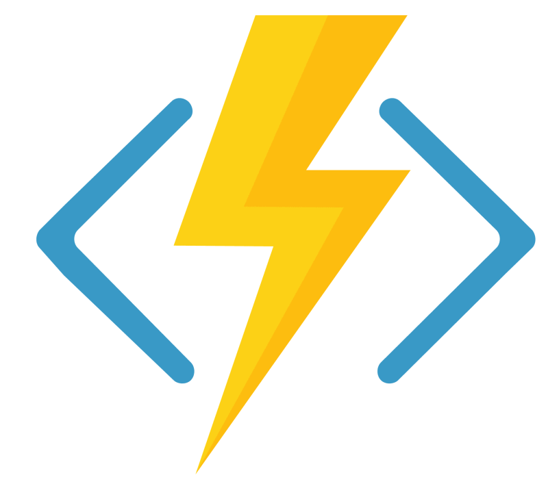
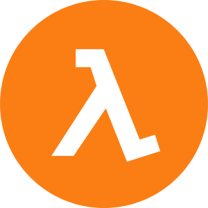
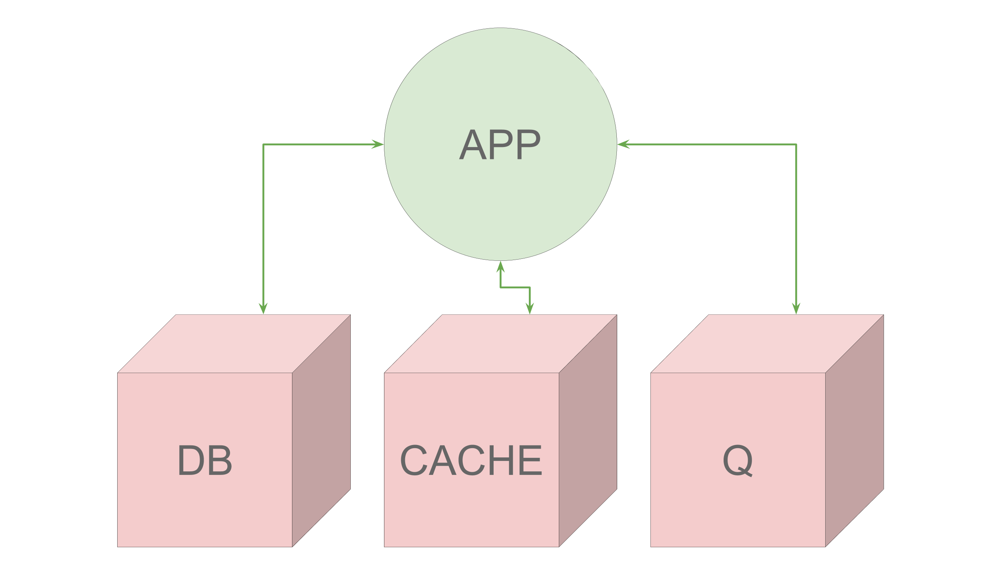
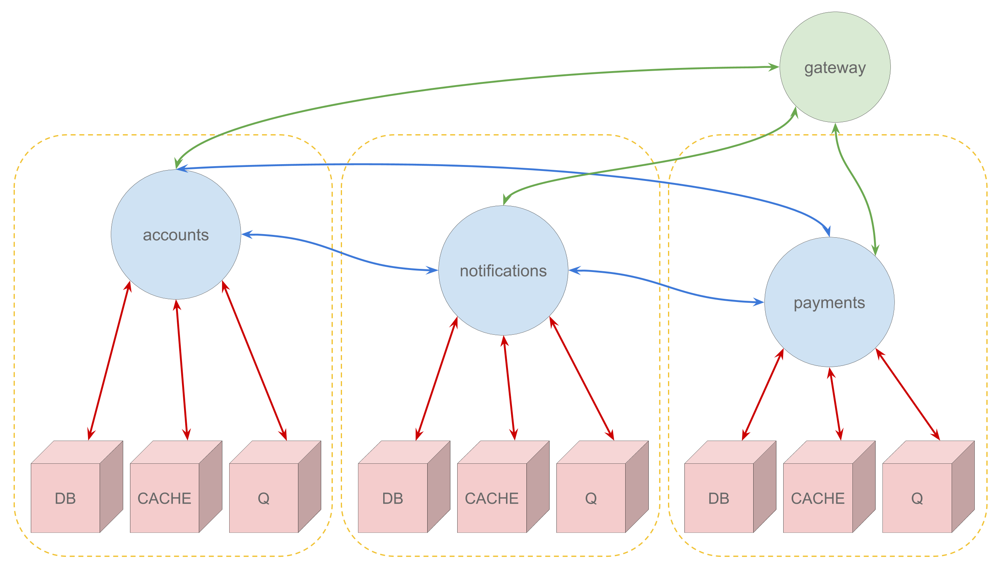
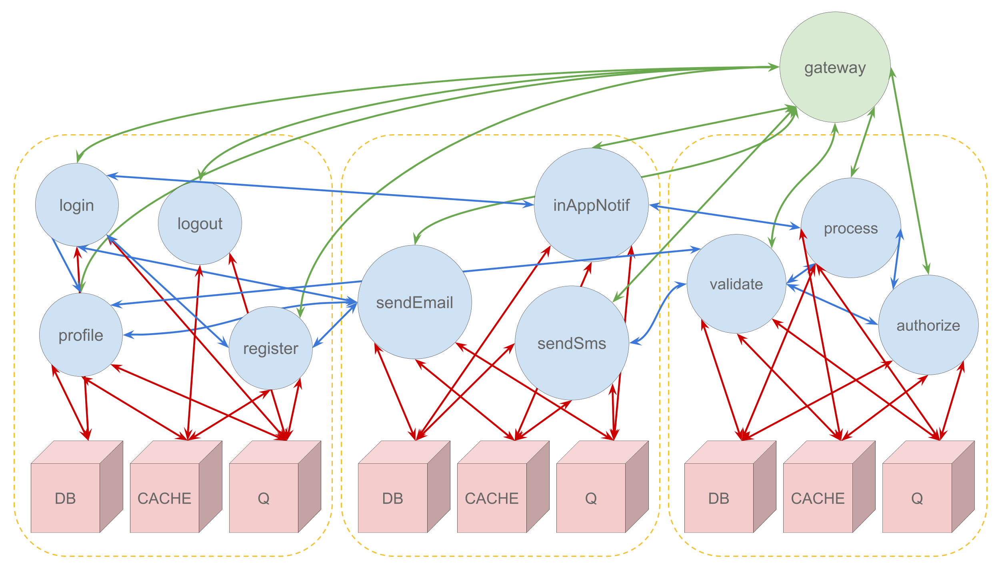

<!-- .slide: data-background="./res/cloud-outline.jpg" -->
<!-- .slide: data-background-color="white" -->
### ~~server~~

------

- joseph (@zephinzer)
- my careers future
- dev/devops

---

### ~~server~~?

------

#### serverless !== no servers

------

backend-as-a-service

functions-as-a-service

------

~~backend-as-a-service~~

**functions-as-a-service**

---

### where we came from

------

##### monolithic
*deploy entire product*  

------

------

##### service oriented
*deploy applications*  

------

------

##### microservices
*deploy self-contained services*  

------

------

##### serverless
*deploy functions*

------

---

### the good

- really small deployments
- language/framework independent
- usage-based scaling

------

##### really small deployments

- lower risk of breaking things

------

##### language/framework independent

- no lock in
- easily disposable code
- onboard based on capability

------

##### scale based on usage

- lower costs
- pay only for what is needed
- `t2.medium`
  - 0.0584/hour
  - 1.4016/day
  - 42.048/month

---

### the bad

- 

------

### use cases

- web hooks
- scheduled tasks
- data extract/transform/load
- 