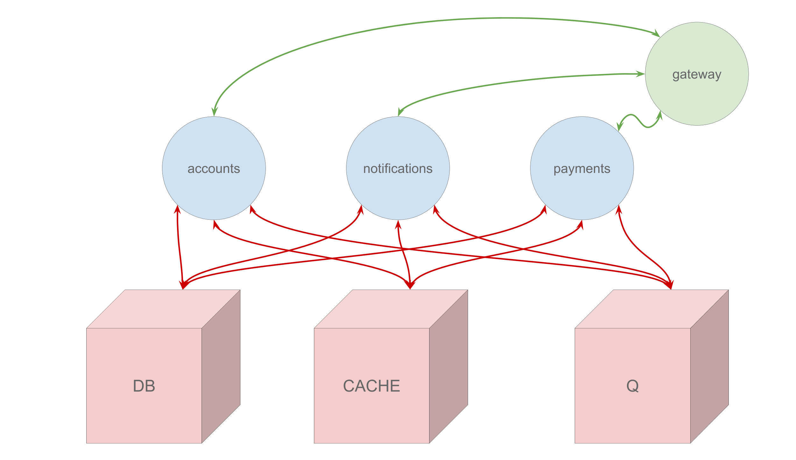
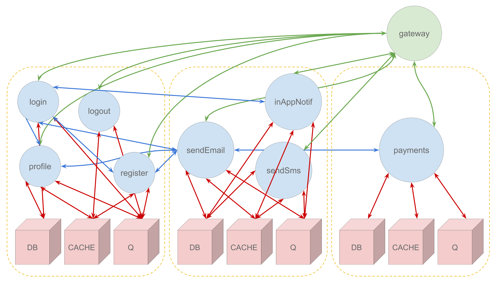

<!-- .slide: data-background="./res/cloud-outline.jpg" -->
<!-- .slide: data-background-color="white" -->
### ~~server~~

------

- joseph (@zephinzer)
- my careers future
- dev/devops

---

### ~~server~~?

------

#### serverless !== no servers

------

backend-as-a-service

functions-as-a-service

------

~~backend-as-a-service~~

**functions-as-a-service**

------

##### monolithic
*deploy entire product*  

------

------

##### service oriented
*deploy applications*  

------

------

##### microservices
*deploy self-contained services*  

------

------

##### serverless
*deploy functions*

------

---

### considerations for serverless

------

##### features

really small deployments

natural separation of concerns

language/runtime independent

scale/deploy based on need

------

##### benefits

low risk deployments

onboard based on capability

ease of contributions

lower costs

------

##### risks

requires structuring

------

##### use cases

##### event driven solutions

data extract/transform/load

payment gateways

notification bots

business rule engines

---

### development

------

##### sync vs async

------

##### hot functions

---

### testing

------

#### contract testing

---

### current tools

------

#### cloud solutions
- [AWS Lambda](https://aws.amazon.com/lambda/)
- [Google Cloud Functions](https://cloud.google.com/functions/)
- [Azure Functions](https://azure.microsoft.com/en-us/services/functions/)
- [WebTask](https://webtask.io/)

------

#### hosted solutions
- [kubeless](https://github.com/kubeless/kubeless)
- [OpenWhisk](https://github.com/apache/incubator-openwhisk)
- [FnProject](https://github.com/fnproject/fn)

------

#### frameworks
- [Serverless](https://github.com/serverless/serverless)

---

is it time for an example?

[yes it is](./example.md)
