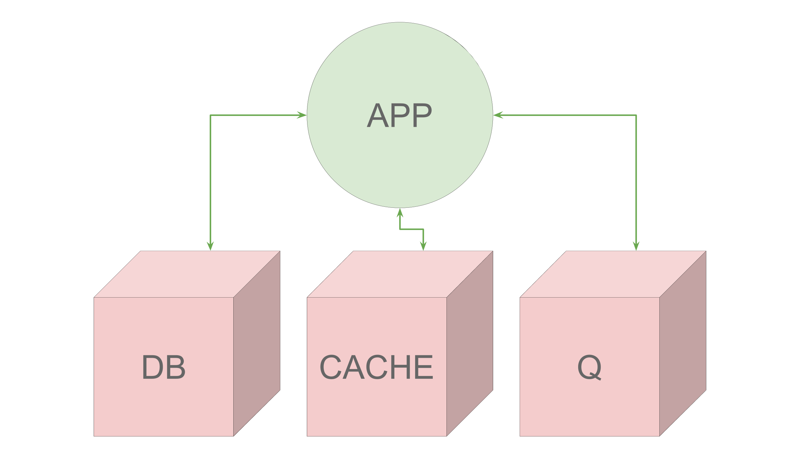
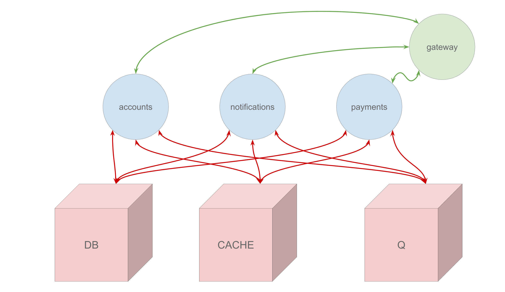
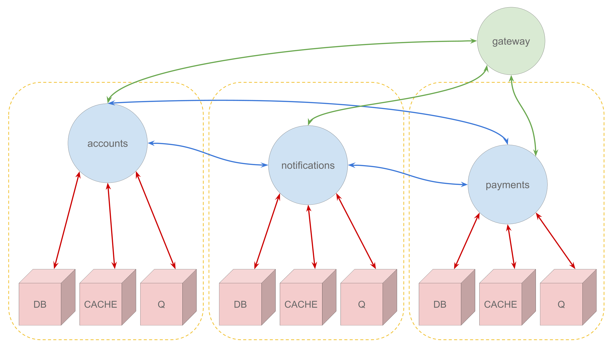
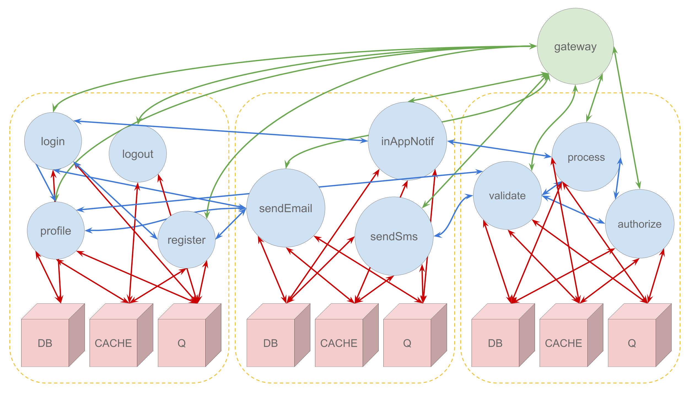

<!-- .slide: data-background="./res/cloud-outline.jpg" -->
<!-- .slide: data-background-color="white" -->
### ~~server~~

------

- joseph (@zephinzer)
- my careers future
- dev/devops

---

### ~~server~~?

------

#### serverless !== no servers

------

backend-as-a-service

functions-as-a-service

------

~~backend-as-a-service~~

**functions-as-a-service**

---

monolith > services > services > f( *x* )

------

##### monolithic
*deploy entire product*  

------

------

##### service oriented
*deploy applications*  

------

------

##### microservices
*deploy self-contained services*  

------

------

##### serverless
*deploy functions*

------

---

<!-- .slide: data-align="left" -->

### the good

- really small deployments
- language/framework independent
- usage-based scaling

------

- lower risk of breaking things
- easily disposable code - no legacy
- onboard based on capability
- ease of outsourcing
- lower costs
- `t2.medium` - 42.048/month
- let's see the [Lambda Pricing Calculator](https://s3.amazonaws.com/lambda-tools/pricing-calculator.html)

---

### the bad

- difficult to debug
- complex integration tests
- relatively immature technologies
- lack of resources

---

### the useful

- web hooks
- scheduled tasks
- data extract/transform/load
- file uploads & pre/post-processing
- event triggered actions

------

- content delivery
- payment processing
- file antivirus scans
- data ingress/sync jobs
- notification systems

---

[methodology and tools](./methodology-and-tools.md)